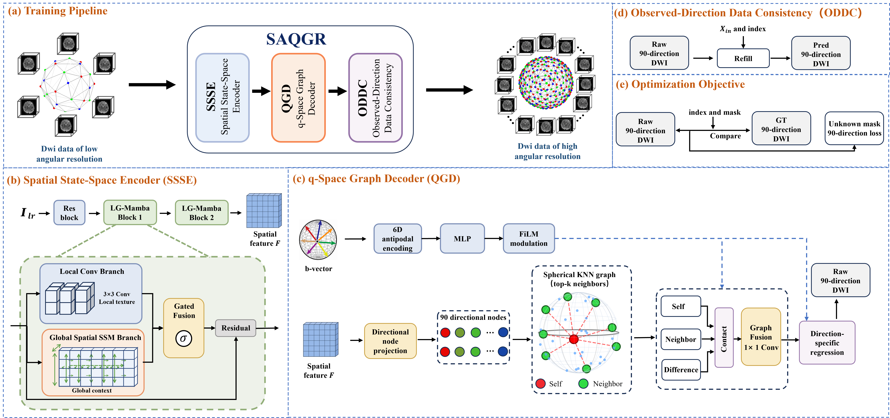

# SAQGR: Spatial-Angular q-Space Guided Reconstruction for dMRI Angular Super-Resolution

This repository contains the PyTorch implementation of **SAQGR**, a spatial-angular reconstruction framework for diffusion MRI (dMRI) angular super-resolution.

The current implementation reconstructs a complete **90-direction DWI** from only **6 or 10 fixed diffusion directions**. The framework combines spatial state-space modeling, q-space graph decoding, and observed-direction data consistency for reliable downstream microstructural analysis.

## 1. Repository structure

```text
.
├── dataset_2d.py   # HDF5 dataset loader and fixed-direction input construction
├── model.py        # SAQGR network: SSSE + QGD + ODDC
├── train.py        # Model training and validation
├── test.py         # DWI reconstruction testing and quantitative evaluation
├── dti.py          # DTI fitting and FA / MD / AD evaluation
├── noddi.py        # Multi-shell NODDI fitting and evaluation
├── requirements.txt
└── README.md
```

## 2. Reconstruction tasks

Four sparse-to-dense angular reconstruction settings are used:

| Task | Input directions | Output directions | Fixed input indices (0-based) |
|---|---:|---:|---|
| `10to90_b1000` | 10 | 90 | `[12, 13, 14, 16, 17, 28, 30, 32, 33, 86]` |
| `10to90_b2000` | 10 | 90 | `[20, 21, 22, 33, 46, 52, 53, 58, 75, 88]` |
| `6to90_b1000` | 6 | 90 | `[7, 37, 39, 68, 69, 81]` |
| `6to90_b2000` | 6 | 90 | `[1, 4, 25, 30, 72, 76]` |

All indices are **0-based** and must be consistent with the ordering of the 90 target diffusion directions.

## 3. Model overview

The overall framework of **SAQGR** is shown below.

<p align="center">
  
</p>

<p align="center">
  <em>Overview of the proposed Spatial-Angular q-Space Guided Reconstruction (SAQGR) framework.</em>
</p>

SAQGR contains three main components:

- **SSSE (Spatial State-Space Encoder):** combines local convolutional features with spatial Mamba modeling to capture both local anatomical details and extended spatial dependencies.
- **QGD (q-Space Graph Decoder):** explicitly incorporates antipodally invariant b-vector features and spherical neighborhood relationships for direction-specific diffusion signal reconstruction.
- **ODDC (Observed-Direction Data Consistency):** restores the physically acquired measurements at their corresponding output indices to ensure measurement consistency.

The model first generates a raw 90-direction prediction and then applies ODDC to obtain the final reconstruction:

```python
pred_raw, pred_final = model(x, bvec_out=bvec_out)

where:

- pred_raw: raw 90-direction prediction before ODDC;
- pred_final: final measurement-consistent 90-direction reconstruction after ODDC.

During training, the reconstruction loss and validation/model selection are computed using pred_raw over all 90 directions. During inference, ODDC is applied to obtain pred_final, which is used as the final reconstruction and is used by default for downstream DTI and NODDI fitting.


## 4. Environment

The code was tested with:

- Python 3.x
- PyTorch `2.4.1+cu121`
- torchvision `0.19.1+cu121`
- CUDA 12.1
- mamba-ssm `2.2.4`
- causal-conv1d `1.5.0.post5`
- DIPY `1.11.0`
- dmri-amico `2.1.1`
- NumPy `2.2.6`
- SciPy `1.16.2`
- scikit-image `0.25.2`
- nibabel `5.3.2`
- h5py `3.14.0`

Install the provided environment with:

```bash
pip install -r requirements.txt
```

`mamba-ssm` requires a CUDA-compatible PyTorch environment. If installation fails during build, installing `causal-conv1d` and `mamba-ssm` separately with the appropriate CUDA toolchain may be required.

## 5. Data format

The data loader expects HDF5-based diffusion MRI data. A typical file contains:

```text
x_10       sparse input DWI, e.g. [S, 10, H, W]
y_90       full 90-direction target DWI, [S, 90, H, W]
mask       brain mask, optional
bvecs_90   target b-vectors, [90, 3]
```

For the 6-direction setting, the corresponding fixed directions are selected from the 90-direction target according to the task-specific indices above.

A typical directory layout is:

```text
dataset_root/
├── train/
│   └── *.h5
├── val/
│   └── *.h5
└── test/
    └── *.h5
```

DWI signals are expected to be preprocessed and normalized consistently before training/testing.

## 6. Main experimental parameters

The main settings used in our experiments are:

| Parameter | Value |
|---|---:|
| Epochs | 80 |
| Batch size | 1 |
| Initial learning rate | `1e-3` |
| Optimizer | Adam |
| LR scheduler | ReduceLROnPlateau |
| LR decay factor | 0.1 |
| Scheduler patience | 10 epochs |
| Output directions | 90 |
| Spatial scan | `hv` |
| Mamba `d_state` | 16 |
| Mamba `d_conv` | 4 |
| Mamba `expand` | 2 |
| Dropout | 0.0 |
| QGD node dimension | 24 |
| Graph layers | 1 |
| Graph top-k | 6 |
| Graph temperature `tau` | 0.15 |

Training uses an L1 reconstruction loss on the **raw 90-direction prediction before ODDC**. The best checkpoint is selected according to validation nRMSE over all 90 raw predicted directions.

## 7. Training

Example for `10to90_b1000`:

```bash
python train.py --data_path /path/to/10to90_b1000 --num_of_channels 10 --num_of_out 90 --epochs 80 --batch_size 1 --lr 0.001 --model_dir ./checkpoints/10to90_b1000 --model_name SAQGR_10to90_b1000.pth --mamba_scans hv --mamba_d_state 16 --mamba_d_conv 4 --mamba_expand 2 --dropout 0.0 --graph_node_dim 24 --graph_layers 1 --graph_topk 6 --graph_tau 0.15
```

Example for `6to90_b1000`:

```bash
python train.py --data_path /path/to/6to90_b1000 --num_of_channels 6 --num_of_out 90 --epochs 80 --batch_size 1 --lr 0.001 --model_dir ./checkpoints/6to90_b1000 --model_name SAQGR_6to90_b1000.pth --mamba_scans hv --mamba_d_state 16 --mamba_d_conv 4 --mamba_expand 2 --dropout 0.0 --graph_node_dim 24 --graph_layers 1 --graph_topk 6 --graph_tau 0.15
```

The same settings can be used for the `b=2000 s/mm^2` tasks by changing the dataset path and task-specific checkpoint path.

## 8. Testing

Example:

```bash
python test.py --direction_task 10to90_b1000 --data_path /path/to/10to90_b1000 --model_path ./checkpoints/10to90_b1000/SAQGR_10to90_b1000.pth --result_path ./results/10to90_b1000 --batch_size 8 --graph_node_dim 24 --graph_layers 1 --graph_topk 6 --graph_tau 0.15
```

The testing script reports reconstruction metrics including:

- MSE
- nRMSE
- PSNR
- SSIM

Both the raw prediction and the ODDC-refilled final reconstruction can be retained for analysis.

## 9. DTI evaluation

`dti.py` fits diffusion tensors from reconstructed 90-direction DWI and evaluates:

- FA: Fractional Anisotropy
- MD: Mean Diffusivity
- AD: Axial Diffusivity

Example:

```bash
python dti.py --direction_task 10to90_b1000 --data_path /path/to/10to90_b1000 --model_path ./checkpoints/10to90_b1000/SAQGR_10to90_b1000.pth --result_path ./results/dti_10to90_b1000 --graph_node_dim 24 --graph_layers 1 --graph_topk 6 --graph_tau 0.15
```

The measurement-consistent output after ODDC is used as the final reconstruction for downstream DTI analysis.

## 10. NODDI evaluation

`noddi.py` jointly uses the reconstructed `b=1000` and `b=2000 s/mm^2` shells and fits NODDI using AMICO.

Example for the `10 -> 90` setting:

```bash
python noddi.py --sampling 10to90 --data_10_b1000 /path/to/10to90_b1000 --data_10_b2000 /path/to/10to90_b2000 --model_10_b1000 ./checkpoints/10to90_b1000/SAQGR_10to90_b1000.pth --model_10_b2000 ./checkpoints/10to90_b2000/SAQGR_10to90_b2000.pth --result_root ./results/noddi --graph_node_dim 24 --graph_layers 1 --graph_topk 6 --graph_tau 0.15
```

The main NODDI-derived maps are:

- `Vic` / NDI
- `Viso` / FWF
- `OD` / ODI

NODDI fitting uses the final ODDC-refilled DWI reconstruction.

## 11. Notes

- The target b-vectors are required by QGD. They can be read from the HDF5 file through `bvecs_90` or provided separately when supported by the script.
- The ordering of `bvecs_90`, `y_90`, and the fixed direction indices must be identical.
- ODDC is deterministic and parameter-free.
- Existing checkpoints are not affected by ODDC when its fixed-index buffer is stored with `persistent=False`.
- HCP and external clinical datasets are not redistributed in this repository. Please follow the corresponding dataset access policies.

## 12. Citation

If you find this code useful, please consider citing our work. Citation information will be updated after publication.

